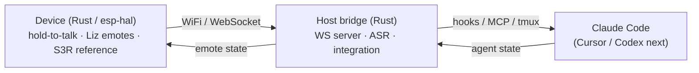

# Vibird 🐤

**Zero-config, cross-agent voice + status companion for vibe coding.**

Language: **English** · [中文](README.zh-CN.md)

Talk to a tiny desktop companion — it feeds your intent to your AI coding agent, shows the agent's live
state with expressive high-refresh animation, and lets you physically approve risky actions without leaving
your flow. The on-device character is **Liz「栗子」**, a 2D-anime companion.

> ⚠️ **Early development.** The design lives in [`docs/human/en/design.md`](docs/human/en/design.md). Nothing
> is stable yet — APIs, protocol, and hardware target will change.

---

## What it is

Vibird turns a tiny device (reference hardware: **M5 AtomS3R**, but the protocol is hardware-agnostic)
into four things for your AI coding session:

- 🎙️ **Voice in** — hold-to-talk dictation straight into **Claude Code** (Cursor / Codex next). You speak
  *intent*; the agent turns it into code.
- 👀 **Ambient status** — a glance shows whether your agent is *idle · listening · thinking · working ·
  waiting for you · done*. Stop babysitting the terminal.
- ✅ **Physical approval** — press to approve or deny the agent's risky tool calls.
- 🪄 **Zero-config** — `pip install vibird`, then your agent reads a bundled skill and **sets the device up
  itself**.

**Why these four?** A market scan (2026-06) found the obvious idea — a Claude desk pet with on-device
approve/deny — is already covered by the platform. The empty gaps are **Claude-native voice**,
**cross-agent control**, and **zero-config setup**. Vibird aims squarely at those. Details and the full
competitive analysis: [`docs/human/en/design.md`](docs/human/en/design.md).

## Architecture

The reusable core is the **host bridge / SDK** (Rust). The device is a thin, expressive client — S3R is the
reference, not a requirement.

## Status

Pre-alpha. Building toward **v0.1** (the voice loop) — see the roadmap in
[`docs/human/en/design.md`](docs/human/en/design.md#6-roadmap).
For the precise current state (what's built and hardware-verified), see
[`docs/agent/SNAPSHOT.md`](docs/agent/SNAPSHOT.md).

## Documentation

- **Agent line** (dense, English-canonical): [`docs/agent/`](docs/agent/) — SNAPSHOT, ADRs, findings,
  hardware reference.
- **Human line** (narrative, bilingual): [`docs/human/en/`](docs/human/en/) ·
  [`docs/human/zh/`](docs/human/zh/).

## License

Vibird is **dual-licensed**:

- **AGPL-3.0** for open-source and community use — see [`LICENSE`](LICENSE). Note the AGPL's network clause:
  if you run a modified Vibird as a network service, you must release your source under the AGPL.
- **Commercial license** for anyone who cannot or does not want to comply with the AGPL — for embedding
  Vibird in a proprietary product or service. Contact **wbj010101@gmail.com**.

## Contributing

Contributions are welcome. Because Vibird is dual-licensed, contributors must agree to the
[Contributor License Agreement](CLA.md) so the project can offer the commercial license. (A CLA bot will
guide you on your first pull request.)

## Star History

