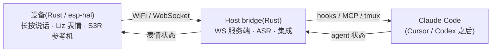

# Vibird 🐤

**零配置、跨 Agent 的 vibe coding 语音 + 状态陪伴设备。**

语言:[English](README.md) · **中文**

对着一只桌面小伙伴说话 —— 它把你的意图喂给 AI 编码 Agent,用高刷新、有表情的动画显示 Agent 的实时状态,
还能让你不离开心流就物理确认危险操作。设备上的角色是 **Liz「栗子」**(二次元半身萌妹子)。

> ⚠️ **早期开发中。** 设计见 [`docs/human/zh/design.md`](docs/human/zh/design.md)。一切尚未稳定 —— API、协议、
> 硬件目标都会变。

---

## 是什么

Vibird 把一个小设备(参考硬件:**M5 AtomS3R**,但协议与硬件无关)变成你 AI 编码会话里的四样东西:

- 🎙️ **语音输入** —— 长按说话,直接听写进 **Claude Code**(之后 Cursor / Codex)。你说*意图*,Agent 变成代码。
- 👀 **环境状态** —— 一眼看到 Agent 是 *空闲 · 在听 · 在想 · 干活 · 等你 · 完成*。别再盯着终端。
- ✅ **物理批准** —— 按一下批准或拒绝 Agent 的危险工具调用。
- 🪄 **零配置** —— `pip install vibird`,然后你的 Agent 读一个内置 skill **自己把设备配好**。

**为什么是这四样?** 2026-06 的市场调研发现:最显而易见的点子 ——「Claude 桌宠 + 端侧批准/拒绝」—— 已经
已被平台方覆盖。仍空着的是 **Claude 原生语音**、**跨 Agent 控制**、**零配置**。Vibird 正对着这三块。完整定位
与竞品分析见 [`docs/human/zh/design.md`](docs/human/zh/design.md)。

## 架构

可复用的核心是 **host bridge / SDK**(Rust)。设备是轻薄、有表情的客户端 —— S3R 只是参考机,不是必需。

## 状态

预览期(pre-alpha)。正在做 **v0.1**(语音闭环)—— 路线图见
[`docs/human/zh/design.md`](docs/human/zh/design.md#6-路线图)。
精确的当前状态(已做了什么、硬件验证了什么)见 [`docs/agent/SNAPSHOT.md`](docs/agent/SNAPSHOT.md)。

## 文档

- **Agent 线**(密集、英文为准):[`docs/agent/`](docs/agent/) —— SNAPSHOT、ADR、findings、硬件参考。
- **人类线**(叙述、中英双语):[`docs/human/zh/`](docs/human/zh/) · [`docs/human/en/`](docs/human/en/)。

## 许可

Vibird 采用 **双授权**:

- **AGPL-3.0** —— 开源与社区使用,见 [`LICENSE`](LICENSE)。注意 AGPL 的网络条款:如果你把改过的 Vibird 作为
  网络服务运行,必须以 AGPL 开放你的源码。
- **商用许可** —— 给无法或不愿遵守 AGPL 的人(把 Vibird 嵌入闭源产品/服务)。联系 **wbj010101@gmail.com**。

## 贡献

欢迎贡献。由于 Vibird 是双授权,贡献者需同意 [贡献者许可协议(CLA)](CLA.md),以便项目能提供商用许可。
(首次 PR 时 CLA 机器人会引导你。)

## Star 增长

